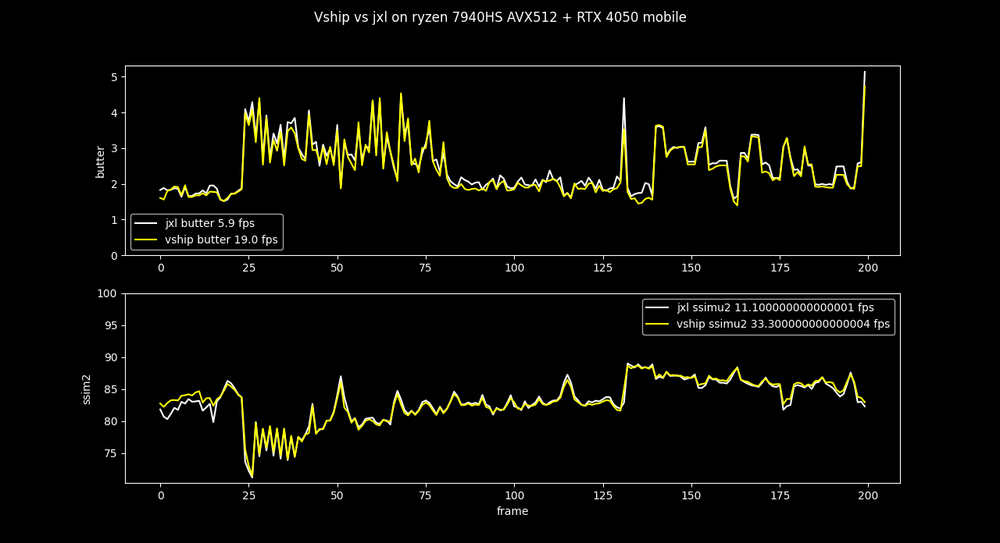

# Vapoursynth-HIP

An easy to use vapoursynth plugin to compute SSIMU2 (SSIMULACRA2) or Butteraugli on GPU

# Usage:

`vs.core.vship.SSIMULACRA2(original, distorded)`
`vs.core.vship.BUTTERAUGLI(original, distorded, intensity_multiplier=80)`

to convert to RGBS:

`vclip = vclip.resize.Bicubic(height=vclip.height, width=vclip.width, format=vs.RGBS, matrix_in_s="709")`

to get the resulting values (can be modified but this is an example):

`res = [[ind, fr.props["_SSIMULACRA2"]] for (ind, fr) in enumerate(vclip.frames())]`

for butteraugli, it is "_BUTTERAUGLI_2Norm", "_BUTTERAUGLI_3Norm" or "_BUTTERAUGLI_INFNorm"

you can try to tune the number of vapoursynth threads
-> more threads can sometimes be faster but with more vram usage (for 1080p it can go up to 300 VRAM MB per threads for ssimu2 and butteraugli)
`vs.core.threads = ?`

# to build:
Warning: it is compiled for the specific gpu used to compile by default

(same for windows and linux)
you need 
- make
- hipcc or nvcc 
- vapoursynth

for nvidia cards:
`make buildcuda`

for amd cards:
`make build`

to install: either use the dll or:
`make install`

# Performance on my laptop on some clip:

# special credits to dnjulek with the ZIG vapoursynth implementation
